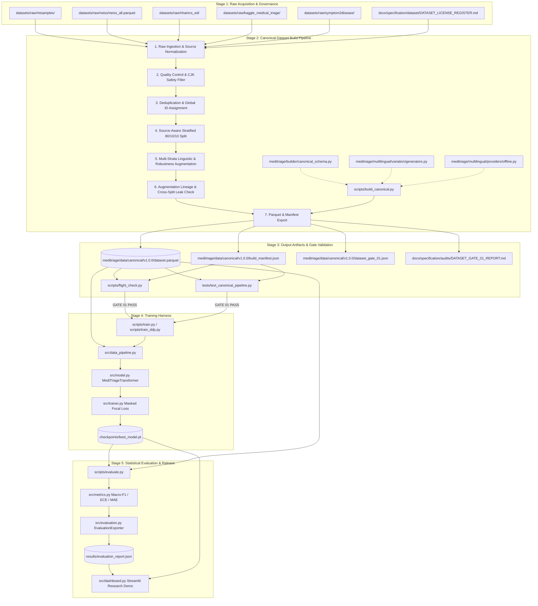

# MediTriageAI — End-to-End Execution Dependency Graph

**Specification Baseline:** `v1.0.0-FROZEN`  
**Document Status:** AUTHORITATIVE EXECUTION FLOW  
**Date:** `2026-08-16`

---

## 1. End-to-End System Pipeline Graph

---

## 2. Linear Execution Stage Sequence

Every official benchmark and training campaign strictly follows this 15-stage sequence:

| Step | Stage Name | Governing Script / Module | Input Artifact(s) | Output Artifact(s) | Blocking Gate |
|---|---|---|---|---|---|
| **01** | `INPUT` | `datasets/raw/**` | External download archives | Raw local files | License clearance |
| **02** | `INGESTION` | `scripts/build_canonical.py` | Raw CSV/Parquet/FWF | Raw record dicts | Source existence |
| **03** | `NORMALIZATION` | `scripts/build_canonical.py` | Raw record dicts | Standard text & headers | No empty strings |
| **04** | `SCHEMA` | `canonical_schema.py` | Standardized dicts | Pre-validated records | 26-field conformance |
| **05** | `LANGUAGE` | `detect_script()` | Text content | Language & script tags | CJK quarantine |
| **06** | `DEDUP` | `deduplicate()` | Pre-split records | Unique records | 0 exact duplicate texts |
| **07** | `SPLIT` | `assign_stratified_splits()`| Deduplicated records | Split-assigned records (80/10/10) | Source & group isolation |
| **08** | `AUGMENTATION` | `augment_records()` | Source records with split | Augmented records (Strata 1–10) | Semantic preservation |
| **09** | `VALIDATION` | `check_leakage()`, `validate_records()` | Full merged dataset | Validation report dict | 0 schema errors, 0 cross-split leaks |
| **10** | `MANIFEST` | `build_manifest.json` builder | Dataset Parquet table | `dataset.parquet` + `build_manifest.json` | SHA-256 computation |
| **11** | `DATASET-GATE-01`| `evaluate_dataset_gate_01()`| Manifest & Parquet | `dataset_gate_01.json`, `DATASET_GATE_01_REPORT.md`| **DATASET-GATE-01 PASS** |
| **12** | `TRAINING` | `scripts/train.py` / `train_ddp.py` | `dataset.parquet` + Config | Checkpoint weights & tensorboard logs | Masked loss convergence |
| **13** | `CHECKPOINT` | `src/checkpoint_manager.py` | Trained weights | `best_model.pt` + `metadata.json` | Checkpoint hash |
| **14** | `EVALUATION` | `scripts/evaluate.py` | Checkpoint + Test split | `evaluation_report.json` | Macro-F1 & ECE computation |
| **15** | `RELEASE` | `scripts/paper/manifest.py` | Evaluation JSON + Model | Final paper tables & figures | Byte-identical disclaimer |
